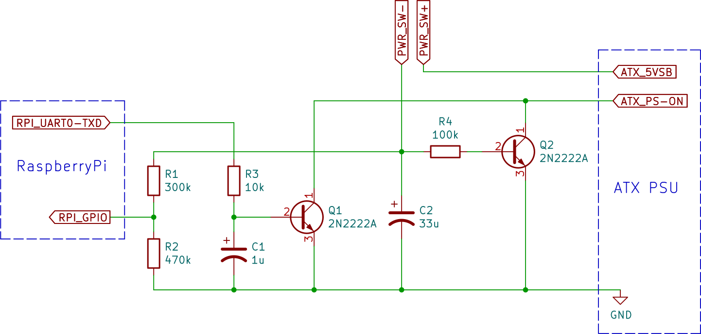

# RaspberryPi ATX PSU control module

With an ATX PSU powering a RaspberryPi, this circuit allows to control power ON / OFF from a single posh button.

More details [on the project official page](https://mathieu-abati.com/en/projects/atx-module/).

## Compatibility

| Board                  | Tested | Working    |
| ---------------------- | ------ | ---------- |
| RaspberryPi 3 Model B  | ✅     | ✅         |
| RaspberryPi 3 Model B+ | ✅     | ✅         |
| RaspberryPi 4 2GB      | ✅     | ✅         |
| RaspberryPi 5 2GB      | ✅     | ❌         |

On RaspberryPi 5, power supply from extension connector is more complicated and is not working as-is with this module.

## Additional resources

For simulation, 2N2222A spice model file is not provided here du to license restrictions. You can download it
[from onSemi website](https://www.onsemi.com/download/models/txt/2n2222a.lib.txt),
and save it as `models/2N2222A.lib`.

For PCB 3D view, you may want the `ATX Connector 24pin 90deg.stp` file. You can
find it from [Grabcad](https://grabcad.com/library/90-atx-connector-24-pins-1).

